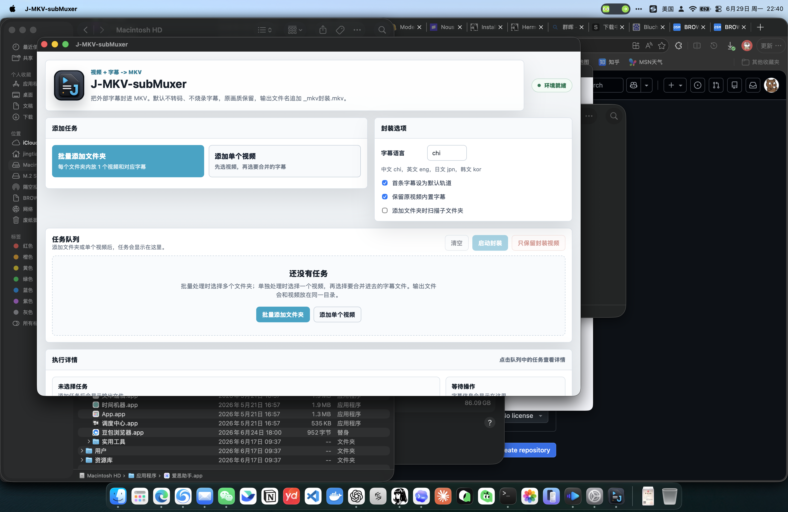

# J-MKV-subMuxer

J-MKV-subMuxer 是一个 macOS 本地桌面工具，用于把视频文件和外部字幕文件封装成一个 MKV 文件。

它做的是软字幕封装：不转码、不烧录字幕、不改变视频画质。输出文件默认保存在原视频同一目录，文件名追加 `_mkv封装.mkv`。



## 适合谁

- 有一个视频文件和一个或多个字幕文件，想合并成一个 `.mkv` 文件。
- 有一批文件夹，每个文件夹内是 1 个视频和对应字幕，想批量封装。
- 不想安装 Homebrew、MKVToolNix、FFmpeg、Python，只想安装 DMG 后直接使用。

## 下载安装

从 GitHub Releases 下载：

- `J-MKV-subMuxer.dmg`
- `J-MKV-subMuxer.dmg.sha256`

安装方式：

1. 打开 `J-MKV-subMuxer.dmg`。
2. 将 `J-MKV-subMuxer.app` 拖入 `Applications`。
3. 首次打开如果被 macOS 拦截，右键点击 `J-MKV-subMuxer.app`，选择“打开”，再确认一次。

当前 DMG 没有 Apple Developer ID 签名，也没有做 Apple notarization。

## 功能

- 批量添加文件夹：推荐每个文件夹内放 1 个视频和对应字幕。
- 添加单个视频：先选择 1 个视频，再选择要封入该视频的字幕。
- 支持外部字幕语言标记，默认 `chi`。
- 可将首条外部字幕设为默认字幕轨。
- 可选择保留原视频内置字幕。
- 可选择扫描子文件夹。
- 队列进度可见，单任务日志可查看。
- 完成后可一键“只保留封装视频”，该操作会二次确认，并把已完成任务的原视频和字幕移到废纸篓。

## 支持格式

视频扩展名：

- `.mp4`
- `.mkv`
- `.mov`
- `.m4v`
- `.avi`
- `.webm`
- `.ts`
- `.m2ts`

字幕扩展名：

- `.srt`
- `.ass`
- `.ssa`
- `.sup`
- `.sub`
- `.idx`
- `.vtt`

`.idx` 字幕通常需要同目录存在同名 `.sub` 文件。

## 使用步骤

批量任务：

1. 点击“批量添加文件夹”。
2. 选择一个或多个文件夹。
3. 检查任务队列。
4. 点击“启动封装”。
5. 完成后点击“定位”查看输出文件。

单个任务：

1. 点击“添加单个视频”。
2. 选择 1 个视频文件。
3. 选择要合并进去的字幕文件。
4. 检查字幕语言和封装选项。
5. 点击“启动封装”。

输出文件示例：

```text
Movie.Name_mkv封装.mkv
```

## 构建要求

构建机需要 macOS，并安装：

- Xcode Command Line Tools
- Homebrew
- MKVToolNix
- FFmpeg

安装构建依赖：

```bash
./install-deps-macos.sh
```

构建 ZIP：

```bash
./build-app-zip.sh
```

构建 DMG：

```bash
./build-dmg.sh
```

构建产物会生成在仓库上一级目录：

```text
../J-MKV-subMuxer-fixed.zip
../J-MKV-subMuxer.dmg
```

## 技术实现

- App 主体：Swift + AppKit + WKWebView。
- 封装引擎：调用 App 内置 `mkvmerge`。
- 发布包内置工具：`mkvmerge`、`ffmpeg`、`ffprobe`。
- 依赖打包：`bundle-homebrew-tools.py` 会复制 Homebrew 二进制和必需动态库，并重写动态库加载路径。

## 当前边界

- 不做硬字幕烧录。
- 不做视频转码。
- 不做音频转码。
- 不调整分辨率。
- 不调整码率。
- 不编辑字幕内容。

## 许可

本项目源码使用 `GPL-2.0-or-later` 开源协议。

发布包内置的 MKVToolNix、FFmpeg、ffprobe 和动态库遵循各自项目的许可证。详见 [THIRD_PARTY_NOTICES.md](THIRD_PARTY_NOTICES.md)。
